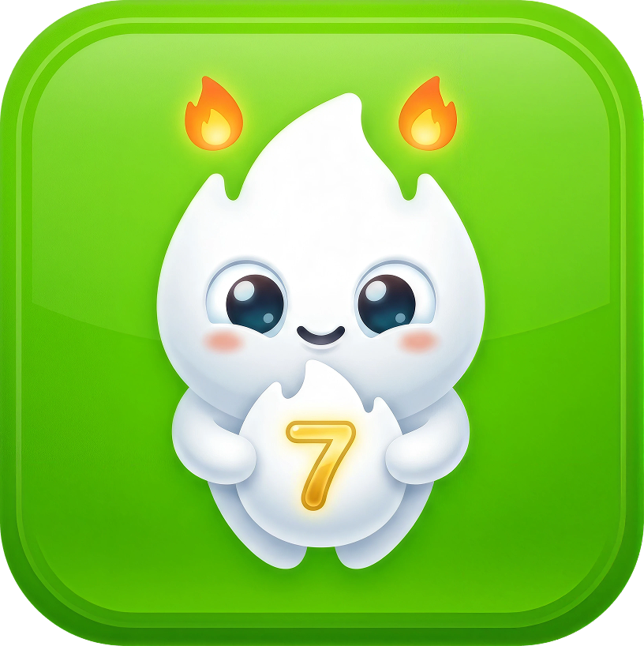

# STREAK 7 🔥

A production-grade, real-time habit tracker, daily task manager, interactive diary, and progress analytics web application featuring **Sev** the Flame mascot, built with React, TypeScript, and Firebase.



## 🚀 Features

- **Google Authentication**: One-click Google Sign-In with persistent session state powered by Firebase Auth.
- **Official Mascot "Sev" 🔥**: Meets Sev—the flame mascot whose fire burns brighter as you complete daily streaks!
- **Real-Time Habit & Task Tracking**: Track habits, compute streaks dynamically, and log real-time activity on a GitHub-style Heatmap.
- **Interactive Personal Diary**:
  - Write daily diary entries with automatic Cloud Firestore synchronization.
  - Interactive calendar date filtering with auto-reset to today's date.
  - Reader popover modal for full entry viewing.
  - Past entries remain archived read-only; Delete & Rewrite options are strictly guarded for today's present entry.
- **Dynamic Stats & Achievements**: Visualize category progress (`Study`, `Work`, `Health`, `Challenges`, `Others`) using interactive Recharts Radar Charts.
- **Duolingo Night Mode Palette**: High-contrast, premium dark mode aesthetic (`#131F24` dark background, `#1B2A32` surface cards, `#58CC02` Feather Green accents, `#FF9600` Fox Orange streak highlights).
- **Automatic Daily Quote Engine**: Generates a brand new motivational quote every 24 hours based on calendar date.
- **Danger Zone Account Management**: Full account deletion support in Settings with complete Cloud Firestore user data purging and Auth account deletion.

## 🛠️ Technology Stack

- **Frontend**: React 18, TypeScript (TSX)
- **Design System**: Duolingo Night Mode palette with Vanilla CSS variables & custom glow cards
- **Backend & Auth**: Firebase Auth & Cloud Firestore real-time database
- **Data Visualization**: Recharts (Radar Charts) & GitHub Activity Heatmap
- **Icons**: Lucide React
- **Build Tool**: Vite, TypeScript
- **Hosting**: Firebase Hosting ([streak7-16fb9.web.app](https://streak7-16fb9.web.app))

## 📦 Getting Started

### Prerequisites

- Node.js (v18 or higher)
- npm or yarn

### Installation

1. Clone the repository:
   ```bash
   git clone https://github.com/Koushigan-S/STREAK-7.git
   cd STREAK-7
   ```

2. Install dependencies:
   ```bash
   npm install
   ```

3. Set up environment variables:
   Create a `.env` file in the project root with your Firebase project credentials:
   ```env
   VITE_FIREBASE_API_KEY=your_api_key_here
   VITE_FIREBASE_AUTH_DOMAIN=your_project_id.firebaseapp.com
   VITE_FIREBASE_PROJECT_ID=your_project_id
   VITE_FIREBASE_STORAGE_BUCKET=your_project_id.firebasestorage.app
   VITE_FIREBASE_MESSAGING_SENDER_ID=your_messaging_sender_id
   VITE_FIREBASE_APP_ID=your_app_id
   VITE_FIREBASE_MEASUREMENT_ID=your_measurement_id
   ```

### Local Development

Start the Vite development server:
```bash
npm run dev
```

Open [http://localhost:5173](http://localhost:5173) in your browser.

### Production Build & Firebase Deployment

1. Build the production bundle:
   ```bash
   npm run build
   ```

2. Deploy to Firebase Hosting:
   ```bash
   npx -y firebase-tools@latest deploy --only hosting
   ```

## 📜 License

This project is open-source and available under the MIT License.
